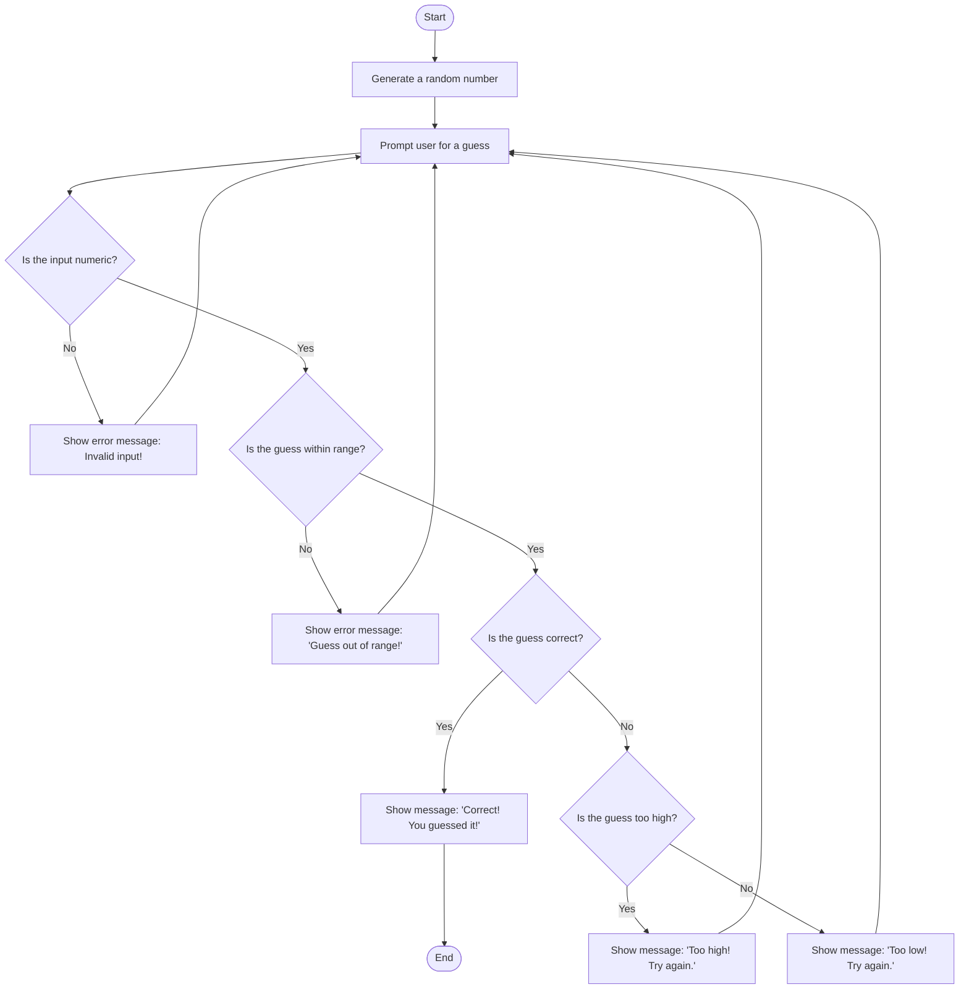

Description:
Start: The program's startup marks the start of the game.
Create a Random Number: The computer creates a random number between 1 and 100, for example.
Ask the User to Guess: The user is asked to make a guess.
Verify Input: The user is requested again and an error notice appears if the input is not numeric.
Go on to the following step if the input is numeric.
Check Range: The user is requested again and an error notice appears if the estimate is beyond the permitted range.
Go on to the next stage if the guess is within range.
Evaluate Guess: Show a success message and terminate the game if the guess is correct.
Notify the user and ask them again if the guess is too high.
Notify the user and ask them again if the guess is too low.
Repeat: Continue steps 3-6 until the user correctly guesses the number.
End: When the right guess is made, the game is over.

